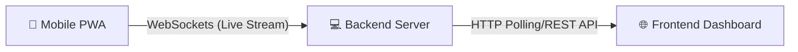

#PULSE 2.0 (Predictive Universal Layup & Surface Evaluation)

**PULSE** is a comprehensive, AI-driven road infrastructure assessment system that transforms an ordinary smartphone into a physics-grade road condition monitoring instrument.

By capturing multi-modal sensor data (GPS, Accelerometer, Gyroscope, Camera, and Audio) via a Progressive Web App (PWA) mounted on a dashboard, PULSE evaluates road roughness (IRI), detects distresses (potholes, cracks), predicts future road deterioration, models economic cascades, and automatically drafts PMGSY-compliant government funding applications.

---

##Key Features

1. **Smartphone-as-a-Sensor (PWA)**: Captures 5 synchronous streams of data at up to 200Hz.
2. **Real-time Pipeline**: Segments roads into 100m chunks and processes them live.
3. **Multi-Agent AI Architecture**:
   - **Sensor Fusion Agent**: Merges IMU, GPS, and depth estimations.
   - **Visual Assessor (Agent 2)**: Evaluates road distresses using Vision-Language Models (VLM) like Gemini or Ollama Qwen3-VL.
   - **Deterioration Oracle (Agent 4)**: Predicts future structural decay.
   - **Economic Cascade (Agent 5)**: Computes societal and economic impacts of road conditions via OpenStreetMap, HDM-4 logic, and LLM reasoning.
   - **Devil's Advocate (Agent 6)**: Validates findings and challenges low-confidence assertions.
   - **Government Pipeline (Agent 7)**: Generates formatted PMGSY funding draft PDFs.
4. **Intel Iris Xe Compatible**: Specifically optimized to run gracefully on laptops with Intel Iris Xe graphics (using CPU fallback or cloud API acceleration).

---

## System Architecture

PULSE is composed of three interconnected systems:



### 1. PWA (Mobile App)
Located in `/PWA`, built with React Native & Expo.
- Mounts on a vehicle dashboard.
- Streams live telemetry, frames, and IMU data to the backend via WebSockets.
- Caches data locally to gracefully handle network drops in rural environments.

### 2. Backend API
Located in `/backend`, built with FastAPI & Python.
- Aggregates and synchronizes high-frequency buffers.
- Orchestrates 7 distinct AI agents per 100-meter segment.
- Connects to DPVO (Deep Patch Visual Odometry) for depth scaling.
- Generates JSON analytics and PDF reports.

### 3. Frontend Dashboard
Located in `/frontend`, built with Next.js, React, and TailwindCSS.
- Visualizes real-time active sessions.
- Displays a rich map plotting distress areas, IRI metrics, and economic impact.
- Renders detailed AI reasoning traces and economic breakdowns.

---

## Quick Start Guide

### Prerequisites
- Python 3.10+
- Node.js 18+
- Expo Go app on your smartphone

### 1. Setup Backend
```bash
cd backend
python -m venv venv
# Activate venv: `venv\Scripts\activate` (Windows) or `source venv/bin/activate` (Mac/Linux)
pip install -r requirements.txt
```
*Be sure to set up your `.env` file (copy `.env.example` to `.env`) with your `GEMINI_API_KEY` for fastest processing.*

### 2. Setup Frontend & PWA
```bash
# In one terminal
cd frontend
npm install

# In another terminal
cd PWA
npm install
```

### 3. Run Everything
We have provided a unified script for Windows environments:
```bash
start_all.bat
```
*(Alternatively, manually run `uvicorn` in the backend, `npm run dev` in the frontend, and `npx expo start` in the PWA).*

### 4. Connect Your Phone
1. Connect your laptop and phone to the **same WiFi network**.
2. Scan the Expo QR code using your phone's camera (or Expo Go).
3. Update the connection URL in the app to point to your laptop's local IP (e.g., `https://192.168.1.100:8000`).
4. Mount your phone on your dashboard and hit **Start Recording**!

---

## Deep Dive Documentation

If you want to understand more about specific subsystems, check out our dedicated documentation files:

- **[START_HERE.md](START_HERE.md)**: The best place to start understanding the project.
- **[ARCHITECTURE.md](ARCHITECTURE.md)**: Details the Multi-Agent architecture and processing pipeline.
- **[SETUP_GUIDE.md](SETUP_GUIDE.md)**: Detailed step-by-step setup, especially for Windows/WSL.
- **[CONNECTION_GUIDE.md](CONNECTION_GUIDE.md)**: Troubleshooting WebSocket and SSL connection issues.
- **[INTEL_IRIS_XE_SETUP.md](INTEL_IRIS_XE_SETUP.md)**: Hardware-specific optimizations.

---

## Tech Stack

- **Backend**: Python, FastAPI, WebSockets, Uvicorn, Pandas, OpenCV, PyTorch.
- **AI Integration**: Google Gemini API, Ollama (Local LLM/VLM support).
- **Frontend**: Next.js, React, Zustand, TailwindCSS, Lucide Icons.
- **Mobile**: React Native, Expo, Expo Sensors, Expo Camera.

---

## Notes for Developers
- The backend relies heavily on `asyncio` to orchestrate heavy ML tasks without blocking the main event loop.
- To reduce API costs or run entirely offline, configure Ollama models (like `qwen3-vl`) in your `.env`.
- Avoid committing `key.pem` or `cert.pem` files; they are generated dynamically for local SSL to permit mobile camera access.
